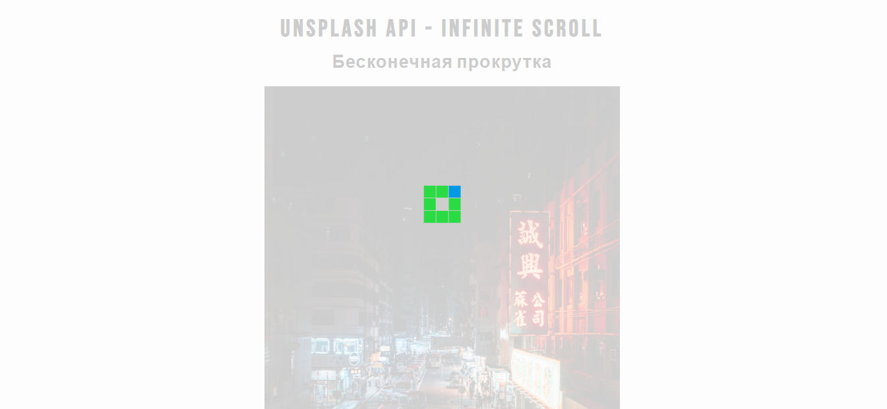
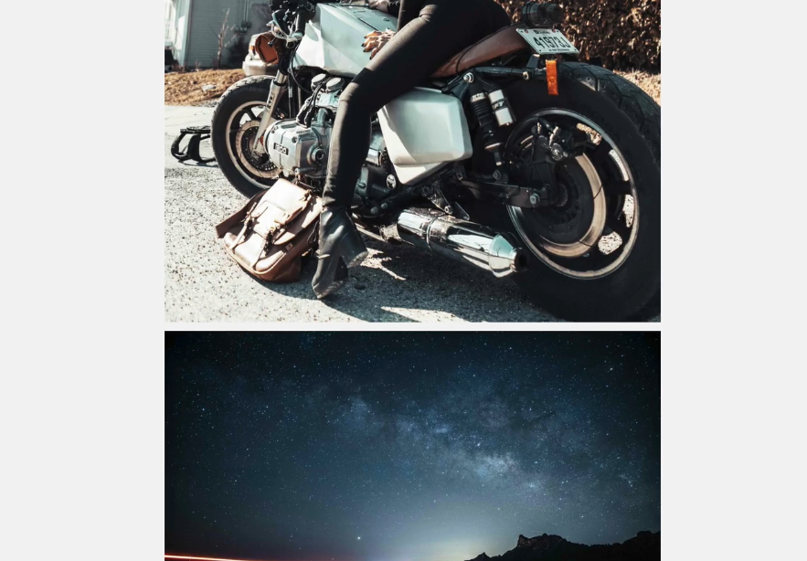

# infinite-scroll (бесконечная прокрутка)
Описание: 
Данный проект является реализацией функционала бесконечной прокрутки (infinity scroll), используемой во всех современных social media. 
Для получения высококачественных изображений используется Unsplash API. 
При первичной загрузке страницы сайта появляется анимированный загрузчик, а также реализуется функционал по увеличению производительности сайта засчет манипулирования счетчиком загружаемых изображений. 
При наведении мышки на загруженное изображение выводится описание этого изображения. Если нажать мышкой на изображение, будет осуществлен переход на официальный сайт unsplash.com, откуда можно загрузить эту картинку, предварительно ознакомившись с ее подробным описанием. 
Идея реализация такая - мы скролим страницу сайта вниз, и до того момента, как мы достигнем дна, event дает триггер на запуск метода получения изображений, изображение загружается "снизу окна браузера" и не дает нам шанс достигнуть дна. И так бесконечно.
Сайт полностью мобильно адаптируем (mobile responsible).
ВНИМАНИЕ: перед запуском Вам необходимо вставить Ваш персональный Unsplash API KEY, который Вы бесплатно можете получить, зарегистрировавшись на unsplash.com/documentation
**Первичная загрузка страницы сайта:** 
 
**Бесконечная прокрутка:** 
 
